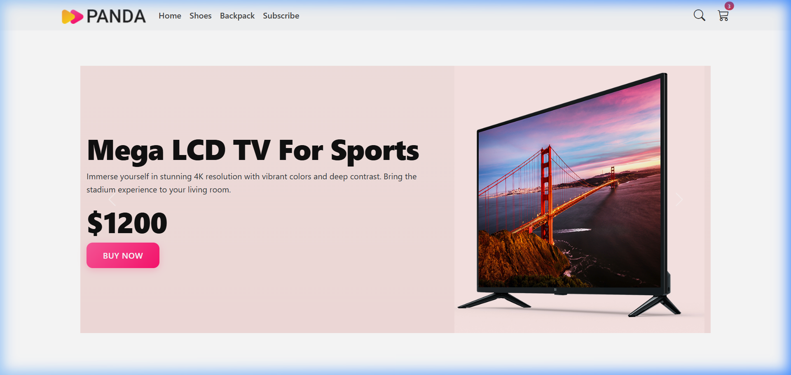
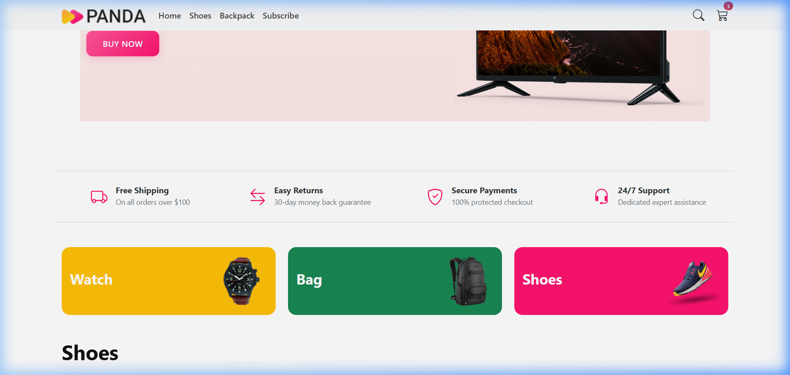
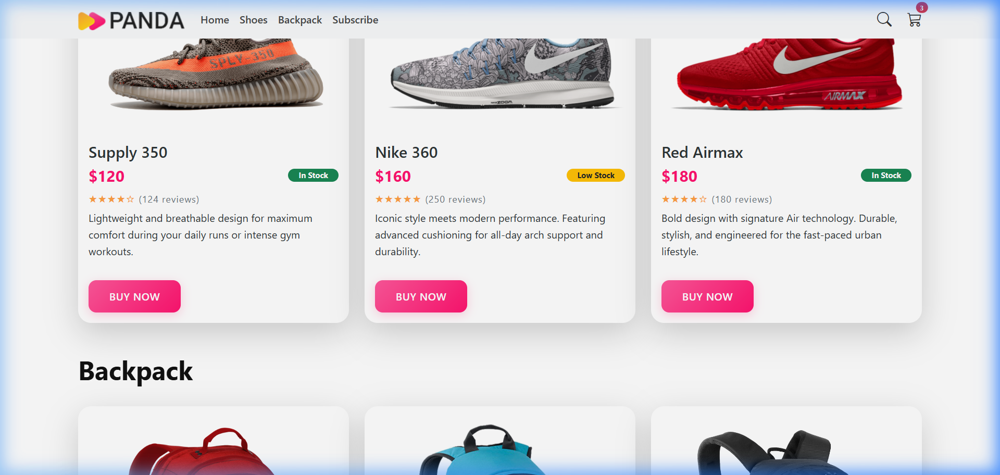
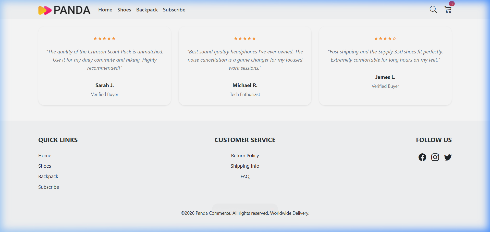
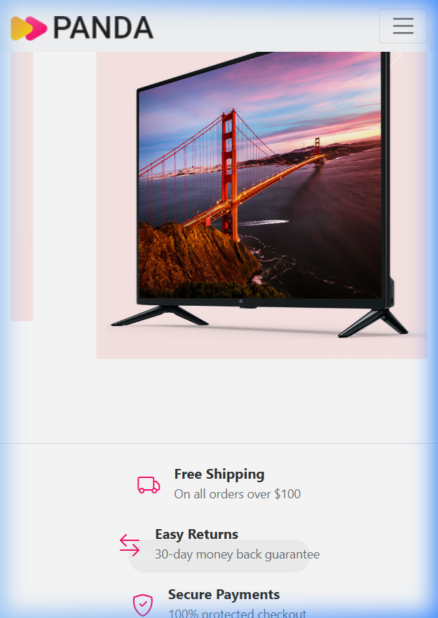

# 🐼 Panda Commerce - Premium E-Commerce Experience

A modern, high-performance, and fully responsive e-commerce landing page built with a focus on premium aesthetics and seamless user interaction.

## 🔗 Live Demo
[Explore Panda Commerce Live](https://wondrous-palmier-85c0bb.netlify.app/)

---

## 📸 Visual Showcase

### ✨ Premium Header & Hero Experience
The site opens with a sleek, integrated navbar and high-impact hero carousel featuring curated electronics and lifestyle products.

### 🛡️ Trust Signals & Integrity
A dedicated trust bar provides customers with immediate confidence through key service highlights.

### 👟 Dynamic Product Collections
Interactive product cards for Shoes and Backpacks with real copy, hover elevations, and status badges.

### 💬 Social Proof & Global Presence
A professional testimonial section paired with a comprehensive 3-column footer and dynamic copyright year.

### 📱 Fully Responsive Design
Seamlessly transitioning from desktop to mobile (375px) with optimized layouts for every device.

---

## 🛠️ Technology Stack

- **HTML5**: Semantic structure for accessibility and SEO.
- **CSS3 (Custom)**: A bespoke design system featuring:
  - **Dynamic Transitions**: 0.2s ease-in-out logic for all interactive elements.
  - **Hover Animations**: Scale and elevation effects for premium tactile feedback.
  - **Glassmorphism**: Subtle background blurs and soft shadows.
- **Bootstrap 5 & Icons**: Utilized for the grid system and professional iconography.
- **Vanilla JavaScript**: 
  - **Dynamic Footer**: Auto-updating copyright year logic.
  - **Subscription Validation**: Custom regex-based newsletter verification.
  - **Interactive Toasts**: Instant visual feedback for "Add to Cart" actions.
- **Netlify**: CI/CD deployment for high-speed edge delivery.

---

## 🚀 Key Features

- **Smooth Navigation**: Enhanced link scrolling with fixed-position navbar anchors.
- **Interactive Categories**: Clickable category cards that scroll dynamically to filtered sections.
- **Micro-Interactions**: Premium lifting effects on hover for all buttons and product cards.
- **Newsletter Engine**: Integrated subscription form with real-time success/error states.
- **Global Design Consistency**: Unified "Panda Pink" color palette and standardized typography hierarchy.

---

## ⚙️ How It Works

1. **Architecture**: The project follows a lightweight, single-page architecture optimized for speed and conversion.
2. **Design Logic**: Every element follows a strict H1 → H5 hierarchy to ensure vertical rhythm and visual clarity.
3. **Performance**: No heavy frameworks—just clean, modular CSS and efficient JavaScript for lightning-fast load times.
4. **Validation**: Forms include both native HTML5 validation and custom JS intercepts to ensure data integrity.

---

## 👨‍💻 Development

The project was evolved through iterative design passes, focusing on transforming a basic template into a premium e-commerce portal with deep attention to detail and user experience.

© 2026 Panda Commerce. Worldwide Delivery.
